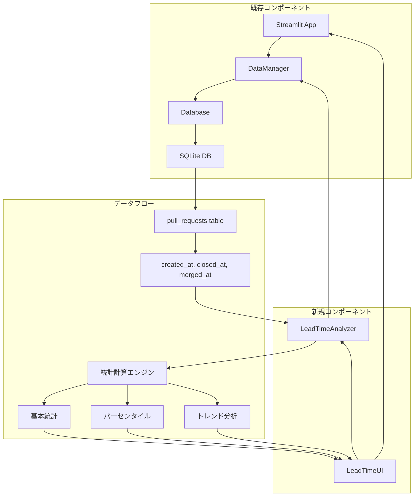

# 設計文書

## 概要

レビューリードタイム分析機能は、既存のStreamlitベースのGitHub PR分析ダッシュボードに新しい分析機能を追加します。この機能は、Pull Requestが作成されてから終了（マージまたはクローズ）されるまでの時間を分析し、統計情報、トレンド、フィルタリング機能を提供します。

既存のアーキテクチャ（DataManager、Database、Streamlit UI）を活用し、新しいコンポーネントを最小限に抑えて実装します。

## アーキテクチャ

### 既存アーキテクチャとの統合



### コンポーネント構成

1. **LeadTimeAnalyzer** - リードタイム計算とデータ分析を担当
2. **LeadTimeUI** - Streamlit UIコンポーネント
3. **DataManager拡張** - 既存DataManagerにリードタイム関連メソッドを追加

## コンポーネントと インターフェース

### 1. LeadTimeAnalyzer クラス

```python
class LeadTimeAnalyzer:
    def __init__(self, data_manager: DataManager):
        self.data_manager = data_manager
    
    def calculate_lead_times(self, pull_requests: List[Dict]) -> List[Dict]:
        """PRリストからリードタイムを計算"""
        
    def get_statistics(self, lead_times: List[float]) -> Dict:
        """統計情報を計算（平均、中央値、パーセンタイル等）"""
        
    def get_trend_data(self, pull_requests: List[Dict], period: str) -> List[Dict]:
        """期間別のトレンドデータを生成"""
        
    def export_to_csv(self, data: List[Dict]) -> str:
        """CSV形式でデータをエクスポート"""
```

#### 統計計算エンジンの詳細

統計計算コンポーネントは以下の3つの主要機能を提供します：

**1. 基本統計計算**
```python
def calculate_basic_statistics(self, lead_times: List[float]) -> Dict:
    """
    基本統計指標を計算:
    - 件数 (count)
    - 平均値 (mean)
    - 中央値 (median)  
    - 最小値 (min)
    - 最大値 (max)
    - 標準偏差 (std_dev)
    """
    return {
        'count': len(lead_times),
        'mean': np.mean(lead_times),
        'median': np.median(lead_times),
        'min': np.min(lead_times),
        'max': np.max(lead_times),
        'std_dev': np.std(lead_times)
    }
```

**2. パーセンタイル分析**
```python
def calculate_percentiles(self, lead_times: List[float]) -> Dict:
    """
    パーセンタイル分布を計算:
    - 25パーセンタイル (Q1)
    - 75パーセンタイル (Q3)
    - 90パーセンタイル
    - 95パーセンタイル
    - IQR (四分位範囲)
    """
    return {
        'p25': np.percentile(lead_times, 25),
        'p75': np.percentile(lead_times, 75),
        'p90': np.percentile(lead_times, 90),
        'p95': np.percentile(lead_times, 95),
        'iqr': np.percentile(lead_times, 75) - np.percentile(lead_times, 25)
    }
```

**3. 外れ値検出と除外**
```python
def remove_outliers(self, lead_times: List[float], method: str = 'iqr') -> List[float]:
    """
    外れ値を検出・除外:
    - IQR法: Q1 - 1.5*IQR または Q3 + 1.5*IQR を超える値
    - Z-score法: 平均から標準偏差の3倍を超える値
    - パーセンタイル法: 95パーセンタイルを超える値
    """
    if method == 'iqr':
        q1, q3 = np.percentile(lead_times, [25, 75])
        iqr = q3 - q1
        lower_bound = q1 - 1.5 * iqr
        upper_bound = q3 + 1.5 * iqr
        return [x for x in lead_times if lower_bound <= x <= upper_bound]
    elif method == 'zscore':
        z_scores = np.abs(stats.zscore(lead_times))
        return [x for i, x in enumerate(lead_times) if z_scores[i] < 3]
```

**4. トレンド分析エンジン**
```python
def calculate_trend_statistics(self, grouped_data: Dict[str, List[float]]) -> Dict:
    """
    期間別トレンド統計を計算:
    - 各期間の平均リードタイム
    - 前期間比の変化率
    - 移動平均（3期間、7期間）
    - トレンド方向（改善/悪化/横ばい）
    """
    trend_data = {}
    periods = sorted(grouped_data.keys())
    
    for i, period in enumerate(periods):
        lead_times = grouped_data[period]
        current_avg = np.mean(lead_times) if lead_times else 0
        
        # 前期間比計算
        change_rate = 0
        if i > 0 and periods[i-1] in trend_data:
            prev_avg = trend_data[periods[i-1]]['average']
            if prev_avg > 0:
                change_rate = ((current_avg - prev_avg) / prev_avg) * 100
        
        trend_data[period] = {
            'average': current_avg,
            'count': len(lead_times),
            'change_rate': change_rate,
            'trend_direction': self._determine_trend_direction(change_rate)
        }
    
    return trend_data
```

### 2. DataManager拡張

既存のDataManagerクラスに以下のメソッドを追加：

```python
def get_pull_requests_with_lead_time_data(self, repository_id: int, 
                                        start_date: Optional[datetime] = None,
                                        end_date: Optional[datetime] = None,
                                        author: Optional[str] = None) -> Tuple[List[Dict], Optional[str]]:
    """リードタイム分析用のPRデータを取得（フィルタリング対応）"""
```

### 3. Streamlit UI拡張

既存のapp.pyに新しいページ/タブを追加：

```python
def display_lead_time_analysis(data_manager: DataManager, selected_repo_data: Dict):
    """レビューリードタイム分析UIを表示"""
```

## データモデル

### 既存テーブルの活用

既存の`pull_requests`テーブルを使用：
- `created_at`: PR作成日時
- `closed_at`: PRクローズ日時  
- `merged_at`: PRマージ日時
- `state`: PR状態（open/closed）

### リードタイム計算ロジック

```python
def calculate_lead_time(pr: Dict) -> Optional[float]:
    """
    リードタイム計算ロジック:
    - マージされたPR: merged_at - created_at
    - クローズされたPR: closed_at - created_at
    - オープンなPR: 現在時刻 - created_at
    """
```

### データ構造

```python
LeadTimeData = {
    'pr_id': int,
    'pr_number': int,
    'title': str,
    'author': str,
    'repository': str,
    'created_at': datetime,
    'closed_at': Optional[datetime],
    'merged_at': Optional[datetime],
    'lead_time_hours': float,
    'lead_time_days': float,
    'state': str
}

StatisticsData = {
    'count': int,
    'average_hours': float,
    'median_hours': float,
    'min_hours': float,
    'max_hours': float,
    'percentile_25': float,
    'percentile_75': float,
    'percentile_90': float,
    'std_deviation': float
}
```

## エラーハンドリング

### 1. データ品質チェック

```python
def validate_pr_data(pr: Dict) -> bool:
    """
    PRデータの妥当性をチェック:
    - created_atが存在する
    - 日付形式が正しい
    - closed_at/merged_atがcreated_atより後
    """
```

### 2. エラー処理パターン

- **データ不足**: 適切なメッセージを表示
- **日付解析エラー**: ログ出力し、該当PRをスキップ
- **計算エラー**: デフォルト値を使用し、警告表示
- **フィルタ結果が空**: 「条件に一致するデータがありません」メッセージ

## テスト戦略

### 1. 単体テスト

```python
# test_lead_time_analyzer.py
class TestLeadTimeAnalyzer:
    def test_calculate_lead_times_merged_pr(self):
        """マージされたPRのリードタイム計算テスト"""
        
    def test_calculate_lead_times_closed_pr(self):
        """クローズされたPRのリードタイム計算テスト"""
        
    def test_get_statistics_normal_case(self):
        """正常な統計計算テスト"""
        
    def test_get_statistics_insufficient_data(self):
        """データ不足時の統計計算テスト"""
```

### 2. 統合テスト

```python
# test_integration_lead_time.py
class TestLeadTimeIntegration:
    def test_end_to_end_analysis(self):
        """エンドツーエンドの分析フローテスト"""
        
    def test_ui_integration(self):
        """UI統合テスト（Streamlitコンポーネント）"""
```

### 3. UIテスト

- Streamlitアプリの手動テスト
- 各フィルタ機能の動作確認
- エクスポート機能の検証
- エラーケースの表示確認

## UI設計詳細

### 1. ナビゲーション拡張

既存のサイドバーに「レビューリードタイム分析」タブを追加：

```python
analysis_type = st.sidebar.radio(
    "分析タイプ",
    ["PR一覧", "レビューリードタイム分析"]
)
```

### 2. フィルタUI

```python
with st.expander("フィルタ設定", expanded=True):
    col1, col2, col3 = st.columns(3)
    
    with col1:
        start_date = st.date_input("開始日")
        
    with col2:
        end_date = st.date_input("終了日")
        
    with col3:
        author_filter = st.selectbox("作成者", options=authors)
```

### 3. 結果表示UI

```python
# 統計サマリー
col1, col2, col3, col4 = st.columns(4)
col1.metric("平均リードタイム", f"{stats['average_hours']:.1f}時間")
col2.metric("中央値", f"{stats['median_hours']:.1f}時間")
col3.metric("最短", f"{stats['min_hours']:.1f}時間")
col4.metric("最長", f"{stats['max_hours']:.1f}時間")

# トレンドチャート
st.line_chart(trend_data)

# 詳細データテーブル
st.dataframe(lead_time_data)
```

### 4. エクスポート機能

```python
if st.button("CSVエクスポート"):
    csv_data = analyzer.export_to_csv(filtered_data)
    st.download_button(
        label="ダウンロード",
        data=csv_data,
        file_name=f"lead_time_analysis_{datetime.now().strftime('%Y%m%d')}.csv",
        mime="text/csv"
    )
```

## パフォーマンス考慮事項

### 1. データ取得最適化

- 必要な列のみをSELECT
- インデックスの活用（created_at, repository_id）
- ページネーション（大量データ対応）

### 2. 計算最適化

- NumPy/Pandasの活用（統計計算）
- キャッシュ機能（Streamlit @st.cache_data）
- 段階的データ処理

### 3. UI応答性

- プログレスバーの表示
- 非同期処理（可能な範囲で）
- 結果の段階的表示

## セキュリティ考慮事項

### 1. 入力検証

- 日付範囲の妥当性チェック
- SQLインジェクション対策（既存のDB層で対応済み）
- ファイルエクスポート時のパス検証

### 2. データアクセス制御

- 既存の認証・認可機構に準拠
- リポジトリレベルのアクセス制御

## 実装フェーズ

### Phase 1: 基本機能
- LeadTimeAnalyzerクラスの実装
- 基本的なリードタイム計算
- 簡単な統計表示

### Phase 2: UI統合
- Streamlit UIの実装
- フィルタリング機能
- 基本的な可視化

### Phase 3: 高度な機能
- トレンド分析
- CSVエクスポート
- パフォーマンス最適化

### Phase 4: テストと改善
- 包括的テスト
- エラーハンドリング強化
- UI/UX改善