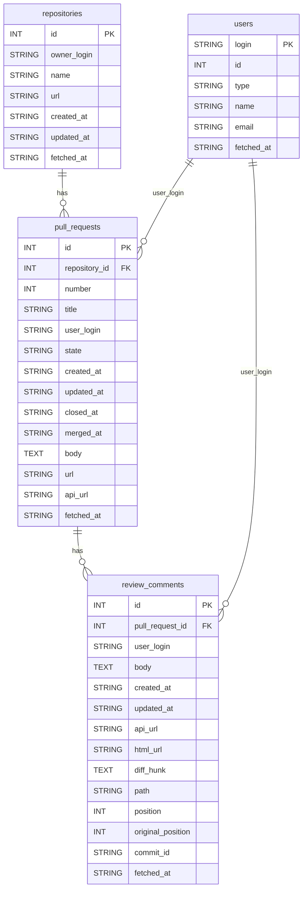

# データモデル設計

以下は、`src/db/models.py` で定義されている4つのテーブルのER図と、各テーブルのカラム情報の詳細です。

---

## ER図

---

## テーブル詳細

### repositories（リポジトリ）
- `id` (INT, 主キー): リポジトリID
- `owner_login` (STRING): オーナーのログイン名
- `name` (STRING): リポジトリ名
- `url` (STRING): リポジトリのURL
- `created_at` (STRING): 作成日時
- `updated_at` (STRING): 更新日時
- `fetched_at` (STRING): データ取得日時

### pull_requests（プルリクエスト）
- `id` (INT, 主キー): プルリクエストID
- `repository_id` (INT, 外部キー): 紐づくリポジトリID
- `number` (INT): プルリクエスト番号
- `title` (STRING): タイトル
- `user_login` (STRING): 作成者のログイン名
- `state` (STRING): 状態（open/closedなど）
- `created_at` (STRING): 作成日時
- `updated_at` (STRING): 更新日時
- `closed_at` (STRING): クローズ日時
- `merged_at` (STRING): マージ日時
- `body` (TEXT): 本文
- `url` (STRING): プルリクエストのURL
- `api_url` (STRING): APIのURL
- `fetched_at` (STRING): データ取得日時

### review_comments（レビューコメント）
- `id` (INT, 主キー): コメントID
- `pull_request_id` (INT, 外部キー): 紐づくプルリクエストID
- `user_login` (STRING): コメント作成者のログイン名
- `body` (TEXT): コメント本文
- `created_at` (STRING): 作成日時
- `updated_at` (STRING): 更新日時
- `api_url` (STRING): APIのURL
- `html_url` (STRING): Web上のURL
- `diff_hunk` (TEXT): 差分の該当部分
- `path` (STRING): ファイルパス
- `position` (INT): 差分上の位置
- `original_position` (INT): 元の位置
- `commit_id` (STRING): コミットID
- `fetched_at` (STRING): データ取得日時

### users（ユーザー）
- `login` (STRING, 主キー): ユーザーのログイン名
- `id` (INT): ユーザーID
- `type` (STRING): ユーザー種別
- `name` (STRING): 名前
- `email` (STRING): メールアドレス
- `fetched_at` (STRING): データ取得日時 