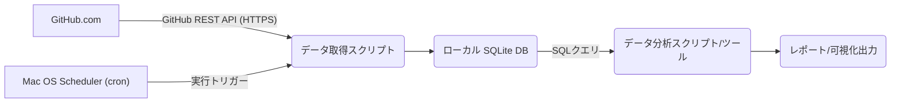

## **GitHub PRログ分析システム 基本設計書**

### **1\. システム構成**

システムは、ローカルMac環境上で以下のコンポーネントが連携して動作する構成とします。

* **GitHub.com:** データソース。  
* **データ取得スクリプト:** Pythonなどのスクリプト言語で実装。GitHub APIを呼び出し、PR、Issueコメント、レビューコメントを取得します。  
* **ローカル SQLite DB:** 取得したGitHubデータを構造化して蓄積します。  
* **データ分析スクリプト/ツール:** Pythonスクリプト（pandasなど使用）またはローカルBIツール。DBからデータを読み込み、メトリクス計算、集計、分析を行います。  
* **レポート/可視化出力:** 分析結果をCSVファイル、簡易的なテキストレポート、またはmatplotlib/seaborn等によるグラフ画像として出力します。ローカルBIツールを使用する場合は、そのダッシュボード機能を利用します。  
* **Mac OS Scheduler (cronなど):** データ取得スクリプトを定期実行するためのスケジューラ機能。

### **2\. DB設計 (SQLite スキーマ案)**

GitHub APIレスポンスの構造を参考に、以下の主要なテーブルを設計します。各テーブルには、APIから取得可能な関連フィールドをカラムとして持ちます。タイムスタンプはSQLiteのTEXT型としてISO 8601形式で格納することを推奨します。

* **repositories** テーブル:  
  * id (INTEGER, Primary Key) \- GitHubリポジトリID  
  * owner\_login (TEXT) \- リポジトリオーナーのログイン名  
  * name (TEXT) \- リポジトリ名  
  * url (TEXT) \- リポジトリURL  
  * created\_at (TEXT) \- 最終データ取得日時  
  * updated\_at (TEXT) \- 最終データ取得日時  
  * fetched\_at (TEXT) \- 最終データ取得日時  
* **pull\_requests** テーブル:  
  * id (INTEGER, Primary Key) \- GitHub PR ID  
  * repository\_id (INTEGER, Foreign Key \-\> repositories.id)  
  * number (INTEGER) \- PR番号  
  * title (TEXT)  
  * user\_login (TEXT) \- PR作成者ログイン名  
  * state (TEXT) \- 'open', 'closed'  
  * created\_at (TEXT) \- 最終データ取得日時  
  * updated\_at (TEXT) \- 最終データ取得日時  
  * closed\_at (TEXT, Nullable) \- 最終データ取得日時  
  * merged\_at (TEXT, Nullable) \- 最終データ取得日時  
  * url (TEXT) \- PRのHTML URL  
  * api\_url (TEXT) \- PRのAPI URL  
  * fetched\_at (TEXT) \- 最終データ取得日時  
* **review\_comments** テーブル:  
  * id (INTEGER, Primary Key) \- GitHubレビューコメントID  
  * pull\_request\_id (INTEGER, Foreign Key \-\> pull\_requests.id) \- 関連するPRのID  
  * user\_login (TEXT) \- コメント投稿者ログイン名  
  * body (TEXT) \- コメント本文  
  * created\_at (TEXT) \- 最終データ取得日時  
  * updated\_at (TEXT) \- 最終データ取得日時  
  * api\_url (TEXT) \- コメントのAPI URL  
  * html\_url (TEXT) \- コメントのHTML URL  
  * diff\_hunk (TEXT) \- コメントが付いたコード差分部分  
  * path (TEXT) \- コメントが付いたファイルパス  
  * position (INTEGER, Nullable) \- diff内の位置  
  * original\_position (INTEGER, Nullable)  
  * commit\_id (TEXT) \- コメントが付いたコミットID  
  * fetched\_at (TEXT) \- 最終データ取得日時  
* **users** テーブル (オプション):  
  * login (TEXT, Primary Key) \- GitHubログイン名  
  * id (INTEGER) \- GitHubユーザーID  
  * type (TEXT) \- 'User', 'Organization' など  
  * name (TEXT, Nullable) \- 表示名  
  * email (TEXT, Nullable)  
  * fetched\_at (TEXT) \- 最終データ取得日時  
  * ※ コメントやPRのユーザー情報はuser\_loginとして保持し、必要に応じてこのテーブルとJOINして詳細情報を取得。  
* **データ量見積もり:**  
  * 100件/日というログが、PR、Issueコメント、レビューコメントの合計件数と仮定します。例えば、1PRあたり平均10コメントとすると、1日あたり約10PR分のデータ増加となります。  
  * 年間で約3650 PR、約36500コメントの増加。  
  * テキストデータ（コメント本文、diff\_hunk）が主ですが、一般的なローカルPCのストレージ容量であれば十分に蓄積可能です。SQLiteはファイルベースのDBであり、管理も容易です。

### **3\. 機能設計**

* **データ取得機能:**  
  * **対象指定:** 設定ファイル（YAMLなど）で対象リポジトリリスト (owner/repo形式）を定義。  
  * **API認証:** 環境変数などでGitHub Personal Access Tokenを安全に管理・使用。  
  * **取得ロジック:**  
    * 各リポジトリについて、最後にデータ取得した日時（repositories.fetched\_atまたはPR/コメントのfetched\_atの最大値）を基準に、それ以降にupdated\_atがあるPR、Issueコメント、レビューコメントを取得。  
    * 新規PRはcreated\_atでもフィルタリング。  
    * APIのページネーションを適切に処理し、全ての該当データを取得。  
    * 取得したデータは、各テーブルのスキーマに合わせて整形。  
  * **DB投入:**  
    * 取得したデータを、対応するテーブルに投入。  
    * 主キー（GitHub ID）に基づいて、データが存在する場合は更新（UPSERT）、存在しない場合は新規挿入を行う。これにより、コメントの編集なども追跡可能。  
    * 投入成功後、fetched\_atカラムを更新。  
  * **エラーハンドリング:** APIレート制限エラー、ネットワークエラー、DB接続エラーなどを検知し、ログに出力。リトライ処理は簡易的に行うか、運用でカバー。  
* **データ分析機能:**  
  * **データ抽出:** SQLite DBファイルに接続し、SQLクエリを使って必要な期間、リポジトリ、ユーザーなどの条件でデータを抽出。  
  * **メトリクス計算:**  
    * **頻度:** SQLのCOUNT(\*)とGROUP BY句を使用。期間別はstrftime()関数などを使用。  
    * **文字数:** SQLのlength(body)関数を使用し、SUM()やAVG()で集計。  
    * **会話関連リードタイム:** タイムスタンプ型（TEXT型）の文字列を比較・処理して差分計算を行うか、Python側で日時オブジェクトに変換して計算し、平均値などを算出。  
  * **集計:** SQLのGROUP BY句やCUBE/ROLLUPなどで多角的な集計。  
  * **分析:** SQLクエリの結果をさらにPython+pandasなどで読み込み、より高度な統計分析や複雑な条件でのフィルタリングを行う。  
* **レポート・可視化機能:**  
  * **簡易レポート:** 分析スクリプトの出力として、主要メトリクスの集計結果を標準出力またはCSVファイルとして出力。  
  * **可視化:** Pythonのmatplotlib/seabornでグラフを作成し、画像ファイルとして保存。  
  * **BIツール連携:** Tableau DesktopなどのMac対応BIツールから、SQLiteファイルに直接接続するか、Python経由でデータを渡してGUIベースでレポートやダッシュボードを作成。

### **4\. 非機能設計**

* **認証:** GitHub APIへの認証にはPersonal Access Token (PAT) を使用。PATは環境変数や安全な設定ファイルで管理し、スクリプト内にハードコードしない。SSH認証はリポジトリへのアクセス権限付与の手段としてGitHubアカウントに紐づいていることを前提とするが、API通信自体はHTTPS+PATで行う。  
* **取得頻度:** Macのcronやlaunchdなどのタスクスケジューラ機能を利用し、毎日指定した時刻（例: 深夜）にデータ取得スクリプトを実行するよう設定。  
* **データ量:** 100件/日というデータ量はSQLiteにとって非常に小さいため、性能上の懸念はほぼない。一般的なローカルPCのストレージ容量で数年分のデータを蓄積可能。  
* **実行環境:** Mac OS上で動作するPython 3、必要なPythonライブラリ（requests, PyGithub, SQLAlchemy[SQLite対応], pandas, matplotlib, seabornなど）を選定・インストール。  
* **使用DB:** ローカルファイルシステムのSQLiteデータベースを使用。  
* **保守性:** データ取得スクリプトの実行ログ（開始、終了、取得件数、エラーなど）をファイルに出力。エラー発生時は標準エラー出力にも重要なメッセージを出力。DBファイル自体のバックアップはユーザーの責任とする。  
* **拡張性:**  
  * 対象リポジトリの追加は設定ファイルの更新で対応。  
  * 新しい分析メトリクスの追加は、主にデータ分析スクリプト/SQLクエリの修正・追加で対応。必要に応じてDBスキーマのマイナーな変更（カラム追加など）が発生する可能性は考慮。
